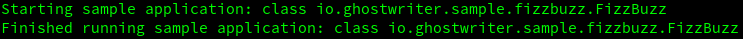
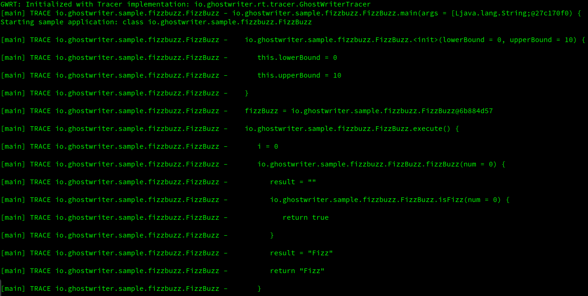

ifdef::env-github[]
:tip-caption: :bulb:
:note-caption: :information_source:
:important-caption: :heavy_exclamation_mark:
:caution-caption: :fire:
:warning-caption: :warning:
endif::[]

ifdef::env-github,env-browser[:outfilesuffix: .adoc]

= GhostWriter
:toc: macro
:version: 0.3.1

image:https://travis-ci.org/GoodGrind/ghostwriter-tracer.svg?branch=master["Build Status", link="https://travis-ci.org/GoodGrind/ghostwriter-tracer"]
image:https://maven-badges.herokuapp.com/maven-central/io.ghostwriter/ghostwriter-rt-tracer/badge.svg["Maven Central", link="http://search.maven.org/#search%7Cga%7C1%7Cg%3A%22io.ghostwriter%22%20v%3A{version}"]
image:https://img.shields.io/badge/license-LGPLv2.1-blue.svg?style=flat["License", link="http://www.gnu.org/licenses/old-licenses/lgpl-2.1.html"]
image:https://api.codacy.com/project/badge/Grade/06f2e1765ae043ee96803257975c8764["Codacy code quality", link="https://www.codacy.com/app/snorbi07/ghostwriter-tracer?utm_source=github.com&utm_medium=referral&utm_content=GoodGrind/ghostwriter-tracer&utm_campaign=Badge_Grade"]

toc::[]

== About
Runtime implementation for _ghostwriter-api_ that provides application flow tracing of your application.
The traced data is sent to either the standard _System.out_ (default) or to an _SLF4J_ handler.

The primary goal of the tracer runtime is to help you preserve your sanity when it comes to figuring out production environments or in situations when you don't have access to a debugger.

== Overview
To summarize what it does, lets take the before/after output of a simple https://raw.githubusercontent.com/GoodGrind/ghostwriter-sample/master/fizzbuzz/src/main/java/io/ghostwriter/sample/fizzbuzz/FizzBuzz.java[FizzBuzz] implementation.

=== Before

=== After
Using http://ghostwriter.io[GhostWriter], the tracer runtime (_ghostwriter-rt-tracer_) and the SLF4J writer (_ghostwriter-tracer-slf4j_), with a _TRACE_ level configuration for _SLF4J_.

As shown on the picture, the complete flow of your application is captured by just adding the dependencies.

== Getting started

First, you need to compile your application with GhostWriter. For details on how to do that, check the http://ghostwriter.io/[README].
With that step done, all that remains is to use the correct dependencies at runtime.
To use the SLF4J or other custom handlers you need to put the corresponding implementation on the classpath
and the https://github.com/GoodGrind/ghostwriter-api[GhostWriter API] calls that get instrumented into you code will load it using a https://docs.oracle.com/javase/8/docs/api/java/util/ServiceLoader.html[ServiceLoader].

The SLF4J implementation uses the _TRACING_ level for outputting serialized events.
The source of the LOG events will be the class that got called (and not a GhostWriter class), so you can rely on your application's existing LOG configurations to set what to log and at which level.

=== Maven
The complete, working example describe in this section can be found https://github.com/GoodGrind/ghostwriter-tracer/blob/master/sample/pom.xml[here].

To add tracing to your application with Maven, you need to add a runtime dependency for _ghostwriter-rt-tracer_. With this single step, your application should dump the tracing information to the standard output (_System.out_).

[source, xml]
----
include::sample/pom.xml[tags=runtime, indent=0]
----

==== SLF4J writer

In order to use the SLF4J writer component of _ghostwriter-rt-tracer_, add the following dependency as well.

[source, xml]
----
include::sample/pom.xml[tags=slf4j, indent=0]
----

Don't forget, to see the tracing output, you need to configure the appropriate SLF4J log level.

=== Gradle
The complete, working example describe in this section can be found https://github.com/GoodGrind/ghostwriter-tracer/blob/master/sample/build.gradle[here].

To add tracing to your application with Gradle, you need to add a runtime dependency for _ghostwriter-rt-tracer_. With this single step, your application should dump the tracing information to the standard output (_System.out_).
[source,groovy]
----
include::sample/build.gradle[tags=runtime,indent=0]
----

==== SLF4J writer

In order to use the SLF4J writer component of _ghostwriter-rt-tracer_, add the following dependency as well.
[source,groovy]
----
include::sample/build.gradle[tags=slf4j,indent=0]
----

Don't forget, to see the tracing output, you need to configure the appropriate SLF4J log level.

== Extending

The _ghostwriter-rt-tracer_ module provides a default string serialization and output strategy.
In order to override the default behaviour custom implementations of the relevant interfaces should be provided.
The _ghostwriter-rt-tracer_ uses the service loader pattern and will use the first implementation found on the classpath.

=== Custom serializer

To provide your own serialization logic for each specific trace event, just create an implementation for the _TracerSerializer_ interface  provided by the _ghostwriter-rt-tracer_ JAR.

[source, java]
----
include::ghostwriter-rt-tracer/src/main/java/io/ghostwriter/rt/tracer/serializer/TracerSerializer.java[tags=serializer, indent=0]
----

To start using it, you need to package it into a standalone JAR, that conforms to the https://docs.oracle.com/javase/7/docs/api/java/util/ServiceLoader.html[ServiceLoader] requirements.
A service provider is identified by placing a provider-configuration file in the resource directory META-INF/services.

In the current case this means providing a file called _io.ghostwriter.rt.tracer.serializer.TracerSerializer_ in your _src/main/META-INF/services_ folder, where the contents of the file correspond to the fully qualified name of your implementation.

Now that your JAR is ready, you just need to specify it as a runtime dependency for your application and the _ghostwriter-rt-tracer_ component will use it.

=== Custom writer

This is the provided extension point in case you want to dump the tracing information in a different way, for example to a service instead of a log file.
The _ghostwriter-rt-tracer-slf4j_ module itself is a concrete example for providing a custom writer.

The first step is to provide an implementation of _TracerWriter_ interface provided by the _ghostwriter-rt-tracer_ JAR.

[source, java]
----
include::ghostwriter-rt-tracer/src/main/java/io/ghostwriter/rt/tracer/writer/TracerWriter.java[tags=writer, indent=0]
----

From here on, you need to follow the same packaging steps/requirements outlined in the _Custom serializer_ section, where the main difference being the service-provider configuration.

For a custom writer, you need to provide a file called _io.ghostwriter.rt.tracer.writer.TracerWriter in your _src/main/META-INF/services_ folder, where the contents of the file correspond to the fully qualified name of your implementation.

You can start using your new custom writer by adding your JAR as a runtime dependency for your application and the _ghostwriter-rt-tracer_ component will use it.